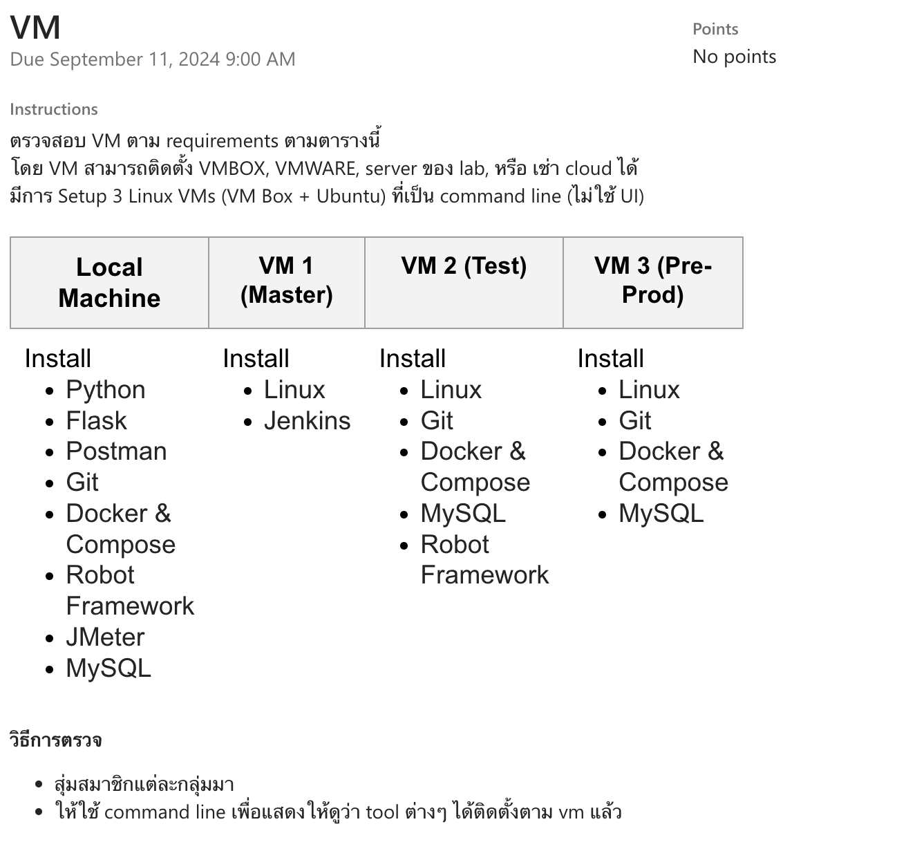

## Softdev : VM Assignment 


## Check Version Local Machine
```
python --version
flask --version
postman -version 
git --version
docker-compose --version
robot --version
jmeter --version
mysql --version
```
## Install Local Machine
Python : [Python download](https://www.python.org/downloads/)

flask
```
pip install Flask
```
postman
```
powershell.exe -NoProfile -InputFormat None -ExecutionPolicy AllSigned -Command "[System.Net.ServicePointManager]::SecurityProtocol = 3072; iex ((New-Object System.Net.WebClient).DownloadString('https://dl-cli.pstmn.io/install/win64.ps1'))"

```
git : [Git download](https://git-scm.com/book/en/v2/Getting-Started-Installing-Git)

docker-compose : [Docker download](https://docs.docker.com/compose/install/)

robot
```
pip install robotframework
```
jmeter : [jmeter download](https://jmeter.apache.org/download_jmeter.cgi)

mysql : [mysql download](https://dev.mysql.com/doc/mysql-getting-started/en/)

## Create VM 1 (Master)
- เข้า VirtualBox
- กด New
    - 
    - 
    - 
    - 
- run vm1 ขึ้นมาแล้วทำการติดตั้ง OS (ติดตั้ง ssh ด้วย)  
     - 
        password : vm1masteradmin  
**Setting VM Network : Bridged Adapter**
**ติดตั้ง Ubuntu เสร็จสิ้นให้ทำการ update package ต่างๆ**
```
sudo apt-get update && sudo apt-get upgrade
```
### จากนั้น Setting Network เพื่อใช้ ssh
```
sudo apt install net-tools

ifconfig 
```

ดู ip : 192.168.1.107 เพื่อนำมา ssh ด้วยคำสั่ง  
เปิด cmd
```
ssh vm1master@192.168.1.107
```
password : vm1masteradmin
## Install Software VM 1  
### Install Jenkins
[Jenkins Install](https://www.jenkins.io/doc/book/installing/linux/)  
- Java Install
    ```
    sudo apt update
    sudo apt install fontconfig openjdk-17-jre
    java -version
    openjdk version "17.0.8" 2023-07-18
    OpenJDK Runtime Environment (build 17.0.8+7-Debian-1deb12u1)
    OpenJDK 64-Bit Server VM (build 17.0.8+7-Debian-1deb12u1, mixed mode, sharing)
    ```
- Jenkins Install for Ubuntu
    ```
    sudo wget -O /usr/share/keyrings/jenkins-keyring.asc \
    https://pkg.jenkins.io/debian-stable/jenkins.io-2023.key
    echo "deb [signed-by=/usr/share/keyrings/jenkins-keyring.asc]" \
    https://pkg.jenkins.io/debian-stable binary/ | sudo tee \
    /etc/apt/sources.list.d/jenkins.list > /dev/null
    sudo apt-get update
    sudo apt-get install jenkins
    ```
### Start Jenkins
You can enable the Jenkins service to start at boot with the command:
```
sudo systemctl enable jenkins
```
You can start the Jenkins service with the command:

```
sudo systemctl start jenkins
```
You can check the status of the Jenkins service using the command:
```
sudo systemctl status jenkins
```
If everything has been set up correctly, you should see an output like this:
```
Loaded: loaded (/lib/systemd/system/jenkins.service; enabled; vendor preset: enabled)
Active: active (running) since Tue 2018-11-13 16:19:01 +03; 4min 57s ago
```
เช็คเวอร์ชั่น : `jenkins --version`  
### ทดสอบ start Jenkins
```
sudo systemctl start jenkins
sudo systemctl enable jenkins
```
เข้า browser : `http://192.168.1.107:8080`  


**เสร็จสิ้น VM 1 (Master)**
### ติดตั้ง OS ใน VM 2 ให้เรียบร้อย
## Install Software VM 2 
- username : vm2test
- password : vm2testadmin
```
ssh vm2test@192.168.1.111
```
**ติดตั้ง Ubuntu เสร็จสิ้นให้ทำการ update package ต่างๆ**
```
sudo apt-get update && sudo apt-get upgrade
```
### Install Git
[Git Install](https://git-scm.com/download/linux)
```
https://git-scm.com/download/linux
```
### Install Docker & Compose
[Docker & Compose Install](https://docs.docker.com/engine/install/ubuntu/)
1. Set up Docker's apt repository.
    ```
    # Add Docker's official GPG key:
    sudo apt-get update
    sudo apt-get install ca-certificates curl
    sudo install -m 0755 -d /etc/apt/keyrings
    sudo curl -fsSL https://download.docker.com/linux/ubuntu/gpg -o /etc/apt/keyrings/docker.asc
    sudo chmod a+r /etc/apt/keyrings/docker.asc

    # Add the repository to Apt sources:
    echo \
    "deb [arch=$(dpkg --print-architecture) signed-by=/etc/apt/keyrings/docker.asc] https://download.docker.com/linux/ubuntu \
    $(. /etc/os-release && echo "$VERSION_CODENAME") stable" | \
    sudo tee /etc/apt/sources.list.d/docker.list > /dev/null
    sudo apt-get update
    ```
1. Install docker-compose
    ```
    sudo apt install docker-compose
    ```
1. Install the Docker packages.
    ```
    sudo apt-get install docker-ce docker-ce-cli containerd.io docker-buildx-plugin docker-compose-plugin
    ```
1. Verify that the Docker Engine installation is successful by running the hello-world image.
    ```
    sudo docker run hello-world
    ```
### Install MySQL
[MySQL Install](https://dev.mysql.com/doc/refman/8.4/en/linux-installation-apt-repo.html)
```
sudo apt-get install mysql-server
```
The MySQL server is started automatically after installation. You can check the status of the MySQL server with the following command:
```
systemctl status mysql
systemctl start mysql
systemctl stop mysql
systemctl restart mysql
```
วิธีเข้า mysql
```
sudo systemctl start mysql.service
sudo mysql
```
### Install Robot Framework
[Robot Framework Install](https://robotframework.org/robotframework/latest/RobotFrameworkUserGuide.html#installing-python-on-linux)
1. check version python and pip
    ```
    python --version
    python3 --version
    pip --version
    ```
    หากไม่ได้ติดตั้ง ให้ใช้คำสั่งนี้ในการติดตั้ง
    ```
    sudo apt install python3

    sudo apt install python3-pip
    ```
    ติดตั้ง Environment Python
    ```
    sudo apt install python3-venv -y
    ```
1. ตั้งค่า Environment Python
    ```
    python3 -m venv .venv
    source .venv/bin/activate
    ```
    วิธีออกจาก env
    ```
    deactivate
    ```
1. ติดตั้ง Robot Framework
    ```
    pip install robotframework

    robot --version
    ```
**เสร็จสิ้น VM 2 (Test)**
### ติดตั้ง OS ใน VM 3 ให้เรียบร้อย
## Install Software VM 3 
- username : vm3
- password : vm3admin
```
ssh vm3@192.168.1.112
```
**ติดตั้ง Ubuntu เสร็จสิ้นให้ทำการ update package ต่างๆ**
```
sudo apt-get update && sudo apt-get upgrade
```
### Install Git
[Git Install](https://git-scm.com/download/linux)
```
https://git-scm.com/download/linux
```
### Install Docker & Compose
[Docker & Compose Install](https://docs.docker.com/engine/install/ubuntu/)
1. Set up Docker's apt repository.
    ```
    # Add Docker's official GPG key:
    sudo apt-get update
    sudo apt-get install ca-certificates curl
    sudo install -m 0755 -d /etc/apt/keyrings
    sudo curl -fsSL https://download.docker.com/linux/ubuntu/gpg -o /etc/apt/keyrings/docker.asc
    sudo chmod a+r /etc/apt/keyrings/docker.asc

    # Add the repository to Apt sources:
    echo \
    "deb [arch=$(dpkg --print-architecture) signed-by=/etc/apt/keyrings/docker.asc] https://download.docker.com/linux/ubuntu \
    $(. /etc/os-release && echo "$VERSION_CODENAME") stable" | \
    sudo tee /etc/apt/sources.list.d/docker.list > /dev/null
    sudo apt-get update
 1. Install docker-compose
    ```
    sudo apt install docker-compose
    ```   ```
1. Install the Docker packages.
    ```
    sudo apt-get install docker-ce docker-ce-cli containerd.io docker-buildx-plugin docker-compose-plugin
    ```
1. Verify that the Docker Engine installation is successful by running the hello-world image.
    ```
    sudo docker run hello-world
    ```
### Install MySQL
[MySQL Install](https://dev.mysql.com/doc/refman/8.4/en/linux-installation-apt-repo.html)
```
sudo apt-get install mysql-server
```
The MySQL server is started automatically after installation. You can check the status of the MySQL server with the following command:
```
systemctl status mysql
systemctl start mysql
systemctl stop mysql
systemctl restart mysql
```
